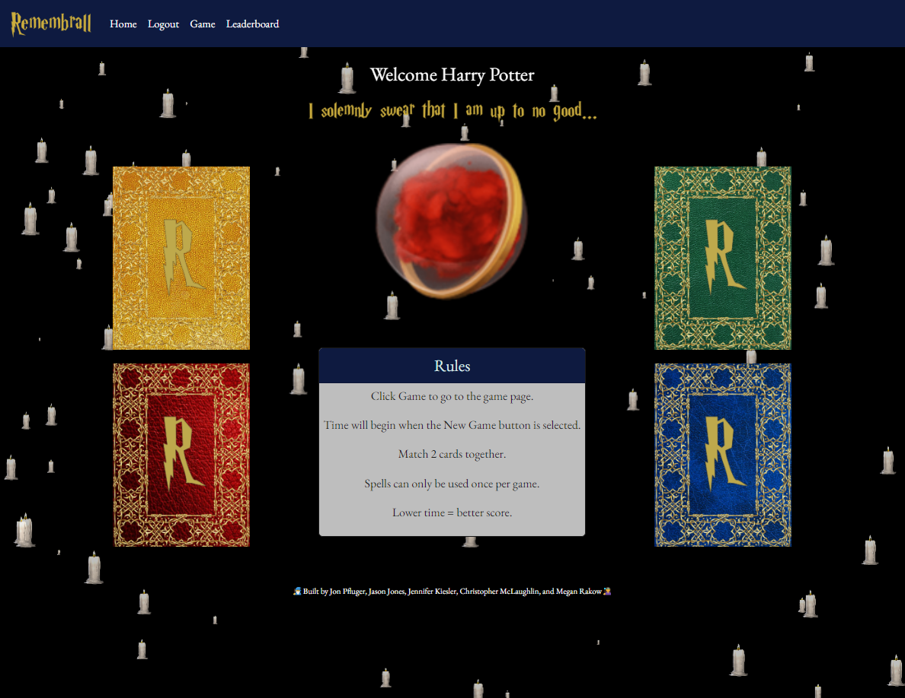

# Remembrall

## Description

This is a group project with a MERN Stack (MongoDb, Express.js, Reactjs, Node.js) development. Uses a GraphQL API with Apollo Server.

We wanted to make a game and we were inspired by the recent Harry Potter game release, so we decided to make our game Harry Potter themed.

## User Story

As a wizard/witch, I want to be able to play a Harry Potter themed memory card game, so that I can exercise my brain and test my memory while having fun.

## Technology Used

- React
- MongoDB/Mongoose
- GraphQL
- Apollo Server
- Apollo Client
- Node.js/Express.js
- Bootstrap
- React-tsparticles
- Adobe Express
- fontspace.com

## Screenshot

## Deployed Link

https://lit-cove-97949.herokuapp.com/

## Collaborators

🧙‍♂️Built by Jon Pfluger, Jason Jones, Jennifer Kiesler, Christopher McLaughlin, and Megan Rakow🧙‍♀️

## Presentation Slides

https://docs.google.com/presentation/d/1wjzhCTJUSL_5W4yAtTBijN04xKch99un5rLv0jDd9Qw/edit?usp=sharing